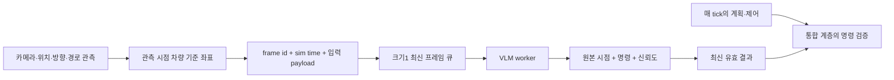

# 비동기 VLM 런타임과 관측 계약

`runtime.py`와 `coordinates.py`는 특정 계획기·시뮬레이터·모델 프레임워크에
의존하지 않는 참조 구현이다. 로컬 통합 주행의 전체 제어 계층과는 구분한다.

## 데이터 흐름



VLM 추론을 제어 루프에서 기다리지 않는다. 이 구조가 시뮬레이터 자체의
시간 진행이나 계획기의 계산 속도를 보장하는 것은 아니다.

## 입력과 시간 계약

1. 카메라와 같은 관측의 위치·방향·목표점으로 차량 기준 좌표를 계산한다.
2. 좌표와 영상 입력을 원본 `frame_id`·시뮬레이션 시각으로 묶어 제출한다.
3. 제출은 기다리지 않으며, 대기 중인 최신 프레임 하나만 유지한다.
4. 응답에도 원본 프레임·시각을 보존한다. 수신 당시 새 차량 위치를 원본
   프롬프트 좌표에 섞지 않는다.
5. 통합 계층은 `latest`를 호출할 때 현재 시뮬레이션 시각·TTL·최소 신뢰도를
   제공한다. 사용할 수 있는 결과가 없으면 `None`을 기본 경로 정책으로 처리한다.

시간 단위와 시각의 기준은 호출자가 일치시킨다. 이미 추론 중인 프레임은
새 프레임 제출로 취소되지 않고, 아직 시작하지 않은 큐 항목만 교체된다.

## 공개 구현이 담당하는 기능

- `capture_navigation`: 같은 세계 좌표계의 변위를 전방·우측 축에 투영하고
  원본 시점과 불변 목표점 튜플을 반환한다.
- `LatestFrameWorker`: 비차단 제출, 최신 대기 관측 유지, 명령 스키마와
  신뢰도 범위 검사, 원본 프레임 추적, TTL·최소 신뢰도 필터를 제공한다.
- 오류가 난 추론은 마지막 정상 결과를 덮어쓰지 않는다. 그 정상 결과도
  나이·신뢰도 조건을 통과해야 노출된다.
- 제출·폐기·완료·실패 횟수를 집계한다.

참조 구현은 의존성을 줄이기 위해 스레드를 사용한다. 실제 GPU 통합에서
별도 프로세스를 사용하더라도 같은 관측·결과 시간 계약을 유지해야 한다.

## 통합 계층이 담당하는 기능

경로 일치, 회전 완료 기억, 정지 우선순위, 명령 안정화, 후보의 경로·속도 선택,
충돌 검사와 실제 제어 입력 연결은 이 worker가 대신하지 않는다.
[동작 설계](concept.md)에 로컬 통합의 책임을 구분한다.

## 검증과 지연 해석

```bash
PYTHONPATH=src python3 -m unittest discover -s tests -v
```

테스트는 큐 교체, TTL·실패 처리, 좌표 회전·원점 불변성과 지연 중 원본 좌표
보존을 검사한다. 이것은 실제 주행의 충돌 회피 성능 검사가 아니다.

로컬 CARLA 기록은 [비동기 검증](async-validation.md)과
[제어 검증](grounded-control-validation.md)에 있다. 동기식 CARLA는 계획기
계산 중 시뮬레이션 진행을 멈출 수 있으므로, 실제 VLM 추론 시간과 수신 시
시뮬레이션 정보 나이를 각각 보고해야 한다. 제어 루프가 VLM을 직접 기다리지
않는 것만으로 실제20Hz 동작이나 추가 지연에 대한 강인성이 입증되지는 않는다.
