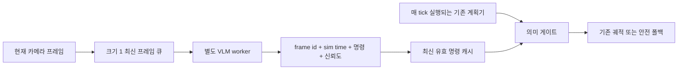

# 비동기 VLM 런타임 설계

> 상태: 구현 및 모의 테스트 완료, 실제 CARLA 주행 미검증.

## 목적

기존 계획기와 저수준 제어는 매 제어 주기 계속 실행하고, 느린 VLM 추론은 별도
worker에서 수행한다. 이 구조는 VLM이 끝날 때까지 시뮬레이터를 멈추지 않는다.
VLM은 여전히 고수준 명령만 제공하며 연속 궤적과 조향·가감속을 직접 만들지 않는다.

## 시간 계약

1. 제어 루프는 프레임을 제출할 때 기다리지 않는다.
2. 아직 추론을 시작하지 않은 프레임은 최대 하나만 유지한다.
3. 더 최신 프레임이 들어오면 대기 중인 이전 프레임을 폐기한다.
4. 결과에는 원본 `frame_id`와 시뮬레이션 시간을 붙인다.
5. 결과가 TTL을 넘었거나 신뢰도 기준을 통과하지 못하면 사용하지 않는다.
6. 유효 결과가 없으면 원래 경로 명령, 목표점, 후보 선택을 유지한다.

CARLA가 동기 모드더라도 이 구조를 사용할 수 있다. 시뮬레이터의 각 tick은 기존
계획기의 제어를 받아 계속 진행하고, VLM 결과는 완료된 이후의 tick부터 반영된다.
따라서 프레임 `t`의 VLM 결과가 프레임 `t+k`에 적용될 수 있음을 로그와 결과
해석에 명시해야 한다.

## 안전 불변조건

- VLM 출력은 경로 일치와 후보 기하 검증을 우회하지 않는다.
- 회전 명령은 경로 플래너가 같은 방향을 지시할 때만 적용한다.
- VLM이 실패하거나 늦으면 기존 계획기를 계속 사용한다.
- 안전 후보가 없으면 VLM이 직접 운전하지 않고 감속·정지 폴백을 사용한다.
- `stop`은 해제 조건을 별도로 두고 일반 명령보다 보수적으로 만료시킨다.
- 명령 진동을 줄이기 위해 최소 유지 시간 또는 히스테리시스를 사용한다.

## 참조 구현의 범위

`src/vlm_async_gate/runtime.py`는 다음 동작만 독립적으로 구현한다.

- 비차단 제출
- 크기 1 최신 프레임 큐
- 결과의 프레임·시뮬레이션 시간 추적
- TTL 및 최소 신뢰도 검사
- 오류 발생 시 마지막 정상 결과 보존
- 제출·폐기·완료·오류 카운터

특정 계획기, CARLA, VLM 프레임워크 코드는 포함하지 않는다. 참조 구현은 의존성을
줄이기 위해 스레드를 사용한다. 실제 GPU 배포에서는 CUDA context와 장애 격리를
고려해 같은 계약을 가진 별도 프로세스를 권장한다.

## 검증 단계

1. 느린 가짜 추론기로 큐 폐기, TTL, 실패 폴백을 단위 테스트한다.
2. 녹화 프레임 재생으로 명령 지연 분포와 stale 비율을 측정한다.
3. 통제된 단일 경로에서 기존 계획기, 동기식 VLM, 비동기 VLM을 비교한다.
4. 교차로에서 이른 회전 결과가 경로 일치 게이트로 보류되는지 확인한다.
5. 충돌, 경로 이탈, 완주율 외에 결과 나이, 폐기율, VLM 처리율을 보고한다.

실제 주행 검증 전에는 이 설계를 동기식 검증 결과와 동일한 수준의 성공 사례로
표현하지 않는다.
